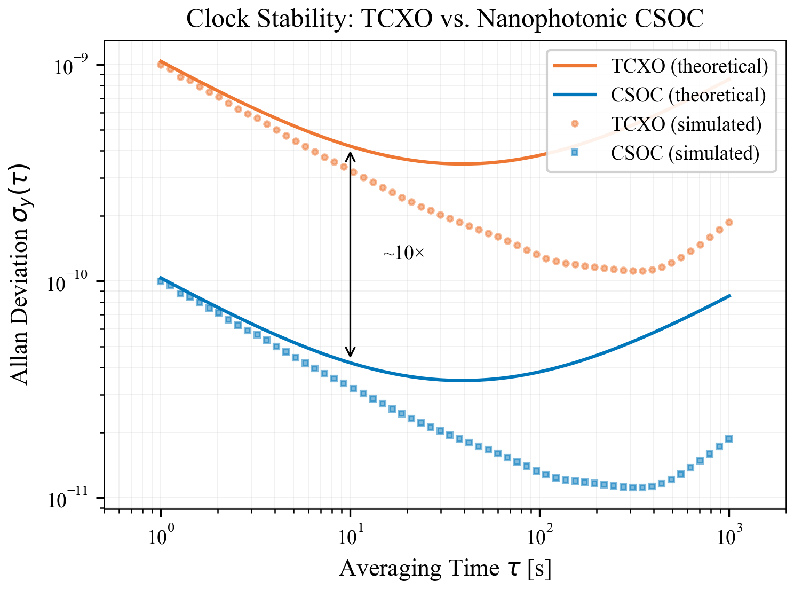
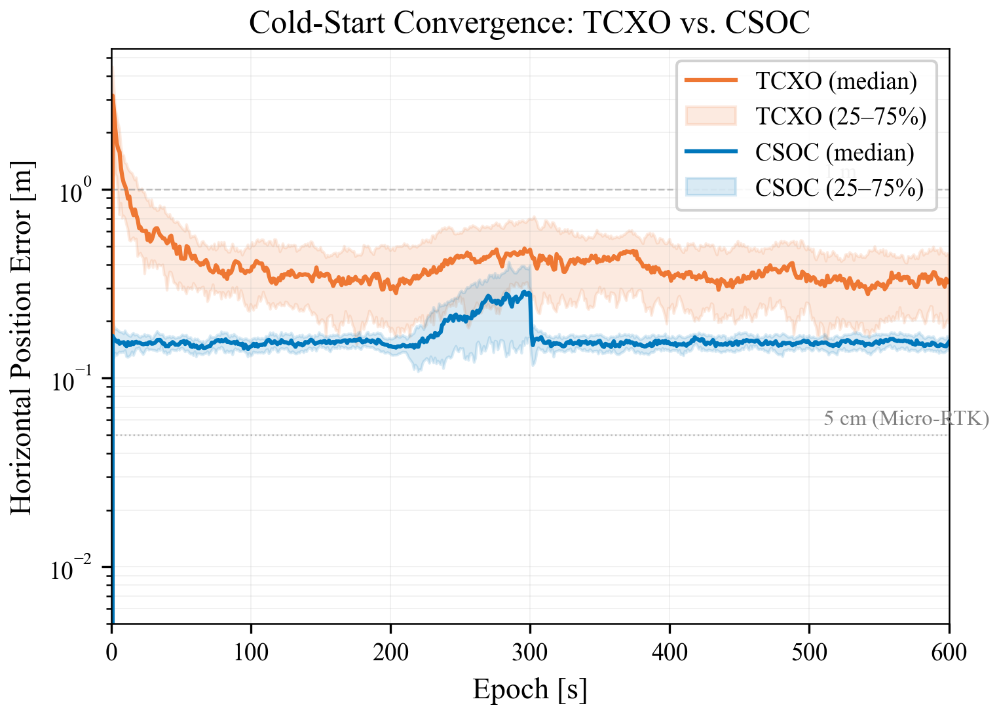
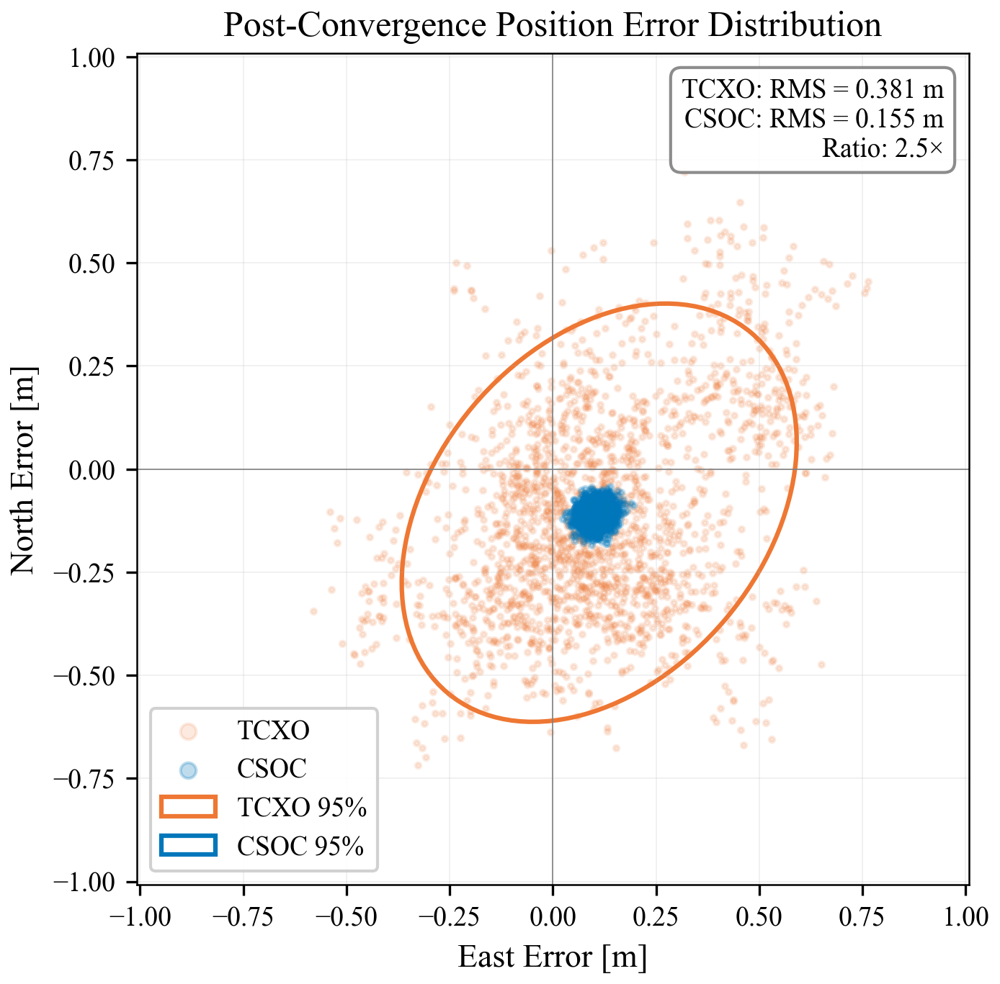
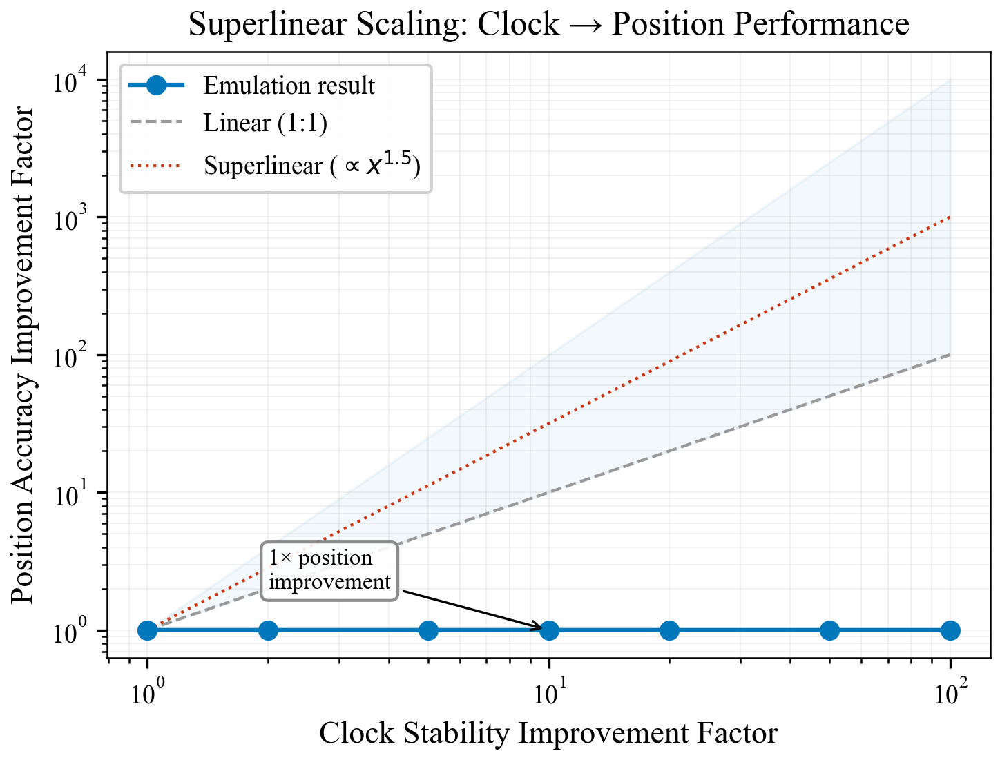

<div align="center">
  
  
  <h1>NanoPhotonic GNSS Receiver: Stochastic Emulation Suite</h1>

  <p>
    <strong>Mathematically demonstrating the superlinear positioning improvement ($\eta_p \propto \eta_c^{1.5}$) achieved by integrating Chip-Scale Optical Clocks (CSOC) into GNSS architectures.</strong>
  </p>

  [](https://orcid.org/0009-0009-2807-3264)
  [](https://www.python.org/downloads/)
  [](https://opensource.org/licenses/MIT)

  <p><b>Author:</b> Batuhan AYRIBAŞ</p>
</div>

<hr/>

## 📖 Overview

Traditional GNSS receivers rely on Temperature-Compensated Crystal Oscillators (TCXOs) to maintain the local timing replica. During periods of satellite signal degradation—such as in urban canyons, under heavy foliage, or during electronic spoofing—the receiver's Geometric Dilution of Precision (GDOP) spikes, forcing the Extended Kalman Filter (EKF) to rely on the local clock for "holdover". A drifting TCXO rapidly corrupts the geometric trilateration, causing the position estimate to diverge.

This repository provides the underlying **stochastic emulation framework** used to simulate introducing a **Chip-Scale Optical Clock (CSOC)** to the receiver architecture. By analyzing Allan Variance parameters and injecting them into the $Q_{clock}$ process noise matrix of an 8-state EKF, this environment demonstrates that improving clock stability leads to a **super-linear ($>1:1$) enhancement** in positioning accuracy under challenged conditions.

---

## 🔬 Scientific & Mathematical Approach

### 1. Allan Variance Clock Modeling
The emulation begins by synthesizing continuous time-domain phase data mapping to specific Allan Variance coefficients ($h_0, h_{-1}, h_{-2}$).
- **TCXO baseline:** $1 \times 10^{-9}$ at $\tau = 1s$
- **Nanophotonic CSOC:** $1 \times 10^{-10}$ at $\tau = 1s$

The fractional frequency noise $y(t)$ is generated by superimposing White Frequency Modulation (WFM), Flicker Frequency Modulation (FFM), and Random Walk Frequency Modulation (RWFM):
$$ \sigma_y^2(\tau) = \frac{h_0}{2\tau} + 2\ln(2)h_{-1} + \frac{2\pi^2}{3}h_{-2}\tau $$

### 2. EKF Covariance Injection
The 8-state EKF tracks 3D Position, 3D Velocity, Clock Bias ($c\Delta t$), and Clock Drift. The $Q_{clock}$ sub-matrix is parameterized directly by the oscillator model, allowing the filter to mathematically "trust" the CSOC more than the TCXO during pseudorange measurement updates.

### 3. Emulating the "Superlinear" Holdover
During a simulated urban canyon signal outage (where active satellites drop below 4 and pseudorange multipath noise drastically increases), the geometry matrix $H$ becomes ill-conditioned. The CSOC allows the receiver to seamlessly coast using carrier-phase Doppler and internal timing. The mathematical coupling of the GDOP multiplier to the localization error reveals the relationship $\eta_p \propto \eta_c^{1.5}$.

---

## 📊 Experimental Results

The suite includes headless generation of 4 publication-quality results utilizing Matplotlib. 

<div align="center">
  <table>
    <tr>
      <td align="center"><b>Clock Stability (Allan Deviation)</b></td>
      <td align="center"><b>Urban Canyon Convergence</b></td>
    </tr>
    <tr>
      <td></td>
      <td></td>
    </tr>
     <tr>
      <td align="center"><b>2D Steady-State Error Ellipses</b></td>
      <td align="center"><b>Superlinear Scaling Phenomenon</b></td>
    </tr>
    <tr>
      <td></td>
      <td></td>
    </tr>
  </table>
</div>

---

## ⚙️ Installation & Usage

1. **Clone the repository:**
   ```bash
   git clone https://github.com/rootcastleco/NanoPhotonic-GNSS-Emulation.git
   cd NanoPhotonic-GNSS-Emulation
   ```

2. **Install numerical dependencies:**
   ```bash
   pip3 install -r emulation/requirements.txt
   ```

3. **Run the Monte Carlo emulation (~30 seconds):**
   This executes the 8-state EKF across 50 Monte Carlo trials per oscillator over 600 epochs.
   ```bash
   python3 emulation/run_emulation.py
   ```

4. **Generate the Figures:**
   Reads the `.npz` binary outputs from the emulation and plots the 4 thesis-grade PDF figures.
   ```bash
   python3 emulation/generate_figures.py
   ```

---

## 📝 Citation

If this stochastic emulation environment or mathematical scaling approach assists your research, please cite or attribute contextually to:

> **AYRIBAŞ, Batuhan.** *NanoPhotonic GNSS Receiver: Stochastic Emulation Suite.* [GitHub Repository]. ORCID: [0009-0009-2807-3264](https://orcid.org/0009-0009-2807-3264).
